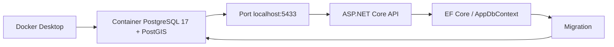

# LocalMate AI — Backend

Nền tảng AI hỗ trợ người dùng tự tạo lịch trình khám phá TP.HCM, ưu tiên các cụm địa điểm tiếp cận thuận tiện qua tuyến Metro số 1.

---

## Mục lục

1. [Tổng quan dự án](#1-tổng-quan-dự-án)
2. [Nghiệp vụ chính](#2-nghiệp-vụ-chính)
3. [Kiến trúc hệ thống](#3-kiến-trúc-hệ-thống)
4. [Cấu trúc thư mục dự án](#4-cấu-trúc-thư-mục-dự-án)
5. [Hướng dẫn setup cho thành viên nhóm](#5-hướng-dẫn-setup-cho-thành-viên-nhóm)

---

## 1. Tổng quan dự án

**LocalMate AI** là một nền tảng web (mobile-first) giúp người dùng — chủ yếu là sinh viên, Gen Z và nhân viên văn phòng trẻ tại TP.HCM — tự tạo lịch trình khám phá thành phố bằng AI, dựa trên vị trí hiện tại, thời gian rảnh, ngân sách, sở thích và phong cách trải nghiệm.

Điểm khác biệt cốt lõi của sản phẩm: hệ thống không tạo lịch trình chung chung, mà ưu tiên tạo các lịch trình **"metro-friendly"** — có logic di chuyển rõ ràng, dựa trên cơ sở dữ liệu địa điểm đã được chọn lọc quanh các cụm ga trọng điểm của tuyến Metro số 1 (Bến Thành, Nhà hát Thành phố, Ba Son, Văn Thánh, Tân Cảng, Thảo Điền, An Phú).

**Giai đoạn hiện tại:** xây dựng bản MVP thật (không còn dùng mock data/localStorage như bản demo), với backend, database và AI Planner kết nối thật.

**Tech stack:**

| Thành phần | Công nghệ |
|---|---|
| Backend | ASP.NET Core Web API (.NET 10, C#) |
| ORM | Entity Framework Core (Code-First + Migrations) |
| Database | PostgreSQL 17.11 + PostGIS 3.5.6 (dữ liệu địa lý qua NetTopologySuite) |
| Auth | JWT Bearer Authentication |
| AI Planner | LLM API (structured JSON output) |
| Bản đồ | Google Maps deeplink / Embed API / JavaScript API |
| Frontend | React + TypeScript + Vite (repo riêng) |

---

## 2. Nghiệp vụ chính

Hệ thống xoay quanh 4 nhóm actor và luồng nghiệp vụ cốt lõi sau:

### Actor
- **Guest User** — chưa đăng nhập, có thể tạo thử lịch trình, xem trước khi bị yêu cầu đăng nhập để lưu.
- **Registered User** — đã có tài khoản, lưu/xem lại/chia sẻ lịch trình, gửi feedback.
- **Trip Organizer** — Registered User tạo lịch trình cho nhóm (bạn bè, lớp học, câu lạc bộ).
- **Admin** — quản lý dữ liệu địa điểm, kiểm duyệt, xem feedback.

### Luồng nghiệp vụ chính
1. Người dùng nhập nhu cầu chuyến đi (vị trí xuất phát, thời lượng, ngân sách, sở thích, phong cách trải nghiệm).
2. Hệ thống xác định cụm địa điểm/ga metro phù hợp, lọc ra danh sách địa điểm ứng viên từ database.
3. **AI Planner** nhận danh sách ứng viên + tiêu chí người dùng, tạo ra lịch trình có cấu trúc (timeline, chi phí dự kiến, lý do đề xuất từng địa điểm, gợi ý thay thế).
4. Người dùng xem lịch trình dạng timeline, có thể xem chi tiết từng địa điểm, thay thế hoặc giữ lại trước khi chốt.
5. Người dùng chốt lịch trình (Draft → Finalized), lưu vào **My Trips**, chia sẻ qua link view-only.
6. Người dùng mở chỉ đường bằng Google Maps deeplink cho từng địa điểm.
7. Sau khi trải nghiệm, người dùng gửi feedback nhanh (rating, tag, bình luận ngắn) — dữ liệu này dùng để cải thiện chất lượng địa điểm và logic gợi ý.
8. Admin quản lý vòng đời dữ liệu địa điểm (thêm/sửa/ẩn/kiểm duyệt) và theo dõi feedback.

### Nguyên tắc quan trọng
- AI **không tự bịa địa điểm** — chỉ chọn và sắp xếp từ danh sách địa điểm đã được Admin kiểm soát trong database.
- AI **không quyết định thay người dùng hoàn toàn** — lịch trình luôn ở trạng thái Draft trước, người dùng xem thông tin từng địa điểm và có quyền thay thế/giữ lại trước khi chốt chính thức.
- Địa điểm đối tác/tài trợ (nếu có) chỉ được đề xuất khi thật sự phù hợp nhu cầu người dùng, và phải minh bạch về yếu tố tài trợ.

---

## 3. Kiến trúc hệ thống

Backend được tổ chức theo hướng **layered architecture** rút gọn còn 3 project, phân chia theo mức độ trừu tượng (không phải theo loại kỹ thuật):

```
Domain  →  Application  →  API
(lõi)      (nghiệp vụ +      (nhận/trả
            hạ tầng)          HTTP)
```

Nguyên tắc phụ thuộc: **luôn đi một chiều từ ngoài vào trong**. `API` được phép biết về `Application`, `Application` được phép biết về `Domain`, nhưng `Domain` không biết gì về 2 tầng còn lại.

### 3.1. `LocalMateAI.Domain`

Tầng lõi — chỉ chứa các class C# thuần mô tả dữ liệu, **không phụ thuộc EF Core hay bất kỳ package ngoài nào**.

| Thư mục | Nội dung |
|---|---|
| `Entities/` | Các entity chính: `User`, `Place`, `MetroStation`, `Trip`, `ItineraryItem`, `Feedback`, `PlaceReview` |
| `Enums/` | Các enum dùng chung: `PlaceCategory` (Cafe, Food, Culture, CheckIn...), `PlaceStatus` (Active, Inactive, Pending), `TripStatus` (Draft, Finalized, Completed), `BudgetStyle` |
| `Common/` | Class dùng chung, ví dụ `BaseEntity` (chứa `Id`, `CreatedAt`, `UpdatedAt` để các entity khác kế thừa) |

### 3.2. `LocalMateAI.Application`

Tầng chứa toàn bộ **logic nghiệp vụ** và **hạ tầng kỹ thuật phục vụ nghiệp vụ** (đã gộp phần Infrastructure vào đây để rút gọn solution, phù hợp quy mô MVP).

| Thư mục | Nội dung |
|---|---|
| `DTOs/` | Object dùng để truyền dữ liệu qua lại giữa API và Service (ví dụ `TripRequestDto`, `ItineraryResultDto`, `PlaceDto`), tách biệt với Entity để không lộ cấu trúc DB ra ngoài |
| `Interfaces/` | Định nghĩa "hợp đồng" (interface) cho Repository và Service, ví dụ `IPlaceRepository`, `ITripService`, `IAiPlannerService` — chỉ khai báo cần làm gì, không viết cách làm |
| `Services/` | Implementation thật của logic nghiệp vụ (`TripService`, `AuthService`) và các service gọi ra ngoài (`AiPlannerService` — gọi LLM API thật) |
| `Repositories/` | Implementation thật của Repository, dùng EF Core truy vấn PostgreSQL (`PlaceRepository`, `TripRepository`) |
| `AiPlanner/` | Logic hỗ trợ AI Planner: dựng prompt (`PromptTemplateBuilder`), validate/parse kết quả JSON trả về từ LLM |
| `Persistence/` | `AppDbContext.cs` — khai báo các `DbSet<T>` tương ứng bảng trong Postgres, là "cổng giao tiếp" chính giữa code và database |
| `Persistence/Configurations/` | Mỗi file cấu hình chi tiết cách 1 Entity map vào bảng (ràng buộc, độ dài, khoá ngoại, index) theo pattern `IEntityTypeConfiguration<T>`, tránh dồn hết vào `AppDbContext` |
| `Mappings/` | Cấu hình AutoMapper để chuyển đổi qua lại giữa Entity và DTO |

### 3.3. `LocalMateAI.API`

Tầng mỏng nhất — chỉ nhận HTTP request, gọi xuống Service tương ứng ở Application, trả response. **Không chứa logic nghiệp vụ.**

| Thư mục/File | Nội dung |
|---|---|
| `Controllers/` | `AuthController`, `TripController`, `PlaceController`, `FeedbackController`, `AdminController` — mỗi controller chỉ gọi Service qua interface |
| `Middlewares/` | Xử lý cross-cutting concern, ví dụ `ExceptionHandlingMiddleware` bắt lỗi tập trung |
| `Program.cs` | Cấu hình pipeline, đăng ký Dependency Injection (DbContext, Repository, Service, JWT Auth) |
| `appsettings.json` | Cấu hình chung (không chứa secret) |

### 3.4. Vì sao gộp Application + Infrastructure

Ở quy mô MVP/đồ án, tách riêng project `Infrastructure` khỏi `Application` tạo thêm chi phí quản lý (thêm project, thêm reference) mà lợi ích thực tế chưa cần thiết. Ranh giới quan trọng nhất cần giữ là:
- **Domain sạch, không phụ thuộc gì** (dễ tái sử dụng, dễ test).
- **API mỏng, không chứa nghiệp vụ** (dễ đọc, dễ maintain).

Bên trong `Application`, vẫn giữ nguyên tắc tách **interface** (`Interfaces/`) khỏi **implementation thật** (`Services/`, `Repositories/`) bằng cách chia folder — nhờ vậy vẫn giữ được lợi ích dễ đổi công nghệ (ví dụ đổi provider AI, đổi ORM) và dễ viết unit test, mà không cần trả giá bằng độ phức tạp quản lý 4 project riêng biệt.

---

## 4. Cấu trúc thư mục dự án

```
LocalMateAI/
├── LocalMateAI.sln
│
├── LocalMateAI.Domain/
│   ├── Entities/
│   ├── Enums/
│   └── Common/
│
├── LocalMateAI.Application/
│   ├── DTOs/
│   ├── Interfaces/
│   ├── Services/
│   ├── Repositories/
│   ├── AiPlanner/
│   ├── Persistence/
│   │   └── Configurations/
│   └── Mappings/
│
└── LocalMateAI.API/
    ├── Controllers/
    ├── Middlewares/
    ├── Program.cs
    ├── appsettings.json
    └── appsettings.Development.json
```

**Lưu ý:** thư mục trống không được Git track. Folder chỉ thật sự "xuất hiện" trong lịch sử Git từ khi có ít nhất 1 file bên trong — đây là hành vi bình thường của Git, không phải lỗi cấu trúc.

---

## 5. Hướng dẫn setup cho thành viên nhóm

### 5.1. Yêu cầu cài đặt trước (cài 1 lần trên máy)

| Công cụ | Ghi chú |
|---|---|
| [.NET 10 SDK](https://dotnet.microsoft.com/download) | Bắt buộc — kiểm tra bằng `dotnet --version` |
| [Visual Studio 2026](https://visualstudio.microsoft.com/) hoặc VS Code | IDE để mở solution |
| Docker Desktop | Chạy PostgreSQL 17 + PostGIS 3.5 thống nhất qua `compose.yaml` |
| [Git](https://git-scm.com/) | Quản lý version |
| EF Core CLI tool | Khôi phục bằng local tool manifest ở mục 5.4 |

> Team dùng Docker để thống nhất PostgreSQL 17 + PostGIS 3.5. Native PostgreSQL 18 trên máy cá nhân không dùng làm database phát triển của dự án.

**Luồng kết nối Database (Docker):**



Giải thích từng bước:
1. **Docker Desktop** chạy container theo `compose.yaml` — mỗi thành viên chạy đúng 1 image `postgis/postgis:17-3.5`, không phụ thuộc PostgreSQL cài native trên máy.
2. **Container PostgreSQL 17 + PostGIS** là database thật, dữ liệu lưu trong Docker volume, độc lập với hệ điều hành host.
3. Container expose ra **`localhost:5433`** (không phải `5432` mặc định) để không xung đột nếu máy đã có PostgreSQL native cài sẵn.
4. **ASP.NET Core API** (`LocalMateAI.API`) đọc connection string trỏ tới `localhost:5433` từ User Secrets (mục 5.5) để kết nối.
5. **EF Core / `AppDbContext`** (nằm ở `LocalMateAI.Application`) là lớp trung gian dịch Entity C# ↔ bảng SQL trong container.
6. Mỗi khi Entity thay đổi, chạy **Migration** (`dotnet tool run dotnet-ef migrations add ...` — mục 5.6) để sinh script cập nhật schema, rồi `database update` áp ngược lại vào chính container ở bước 2 — khép kín vòng lặp, không ai cần cài Postgres native để dev.

**Khởi tạo database bằng Docker:**

1. Sao chép `.env.example` thành `.env`, thay `POSTGRES_PASSWORD` bằng mật khẩu local riêng.
2. Chạy `docker compose up -d database`. Container dùng image `postgis/postgis:17-3.5`, expose cổng host `5433` mặc định để không xung đột PostgreSQL native ở `5432`.
3. Đợi healthcheck thành công, rồi kiểm tra:
   ```bash
   docker compose exec database psql -U localmate -d localmateai -c "SELECT version(); SELECT PostGIS_version();"
   ```
4. Compose mount script khởi tạo `docker/postgres/init/01-enable-postgis.sql`; PostGIS được bật khi volume database mới được tạo. Không commit `.env` hoặc mật khẩu local.

### 5.2. Clone repository

```bash
git clone <repo-url>
cd LocalMateAI
```

### 5.3. Restore package

```bash
dotnet restore
```
Lệnh này tự động tải toàn bộ NuGet package đã khai báo trong các file `.csproj` (EF Core, Npgsql, NetTopologySuite, JWT Bearer...) — không cần cài thủ công.

### 5.4. Cài EF Core CLI tool (bắt buộc, riêng cho từng máy)

Đây là công cụ dòng lệnh dùng để chạy migration. Project pin version trong local tool manifest để cả nhóm không dùng nhầm major version:

```bash
dotnet tool restore
```

Kiểm tra cài thành công:
```bash
dotnet tool run dotnet-ef --version
```

### 5.5. Cấu hình connection string bằng User Secrets

**Không commit connection string vào Git.** Mỗi thành viên tự set riêng trên máy mình bằng User Secrets:

```bash
cd LocalMateAI.API
dotnet user-secrets set "ConnectionStrings:DefaultConnection" "Host=localhost;Port=5433;Database=localmateai;Username=localmate;Password=<mật_khẩu_.env>"
```

### 5.6. Chạy migration để tạo database

```bash
dotnet tool run dotnet-ef migrations add <MigrationName> --project LocalMateAI.Application --startup-project LocalMateAI.API --context AppDbContext
dotnet tool run dotnet-ef database update --project LocalMateAI.Application --startup-project LocalMateAI.API --context AppDbContext
```

> `--project` chỉ định project chứa `AppDbContext` (`LocalMateAI.Application`), `--startup-project` chỉ định project chạy được (`LocalMateAI.API`) — cần khai báo rõ vì `AppDbContext` không nằm cùng project với `Program.cs`.

Kiểm tra bằng pgAdmin/DBeaver xem các bảng đã được tạo đúng trong database `localmateai` chưa.

### 5.7. Chạy project

```bash
cd LocalMateAI.API
dotnet run
```

Hoặc mở `LocalMateAI.sln` bằng Visual Studio, chọn `LocalMateAI.API` làm Startup Project, nhấn `F5`.

Trong môi trường Development, truy cập `https://localhost:7144/swagger` để xem OpenAPI và kiểm thử endpoint.

### 5.8. Quy ước làm việc nhóm (bổ sung khi nhóm thống nhất)

- Branch chính: `main` (protected). Mỗi tính năng làm trên nhánh `feature/<tên-tính-năng>`, tạo Pull Request vào `dev` trước khi merge vào `main`.
- Không commit trực tiếp `appsettings.Development.json` nếu chứa secret — dùng User Secrets như hướng dẫn ở mục 5.5.
- Mỗi khi thêm/sửa Entity, nhớ tạo migration mới và **commit file migration cùng lúc với thay đổi code**, để cả nhóm đồng bộ schema:
  ```bash
  dotnet tool run dotnet-ef migrations add <TênMôTảThayĐổi> --project LocalMateAI.Application --startup-project LocalMateAI.API --context AppDbContext
  ```

---

*Tài liệu này mô tả trạng thái khung sườn backend hiện tại. Cập nhật thêm khi có thay đổi cấu trúc hoặc quy ước nhóm mới.*
